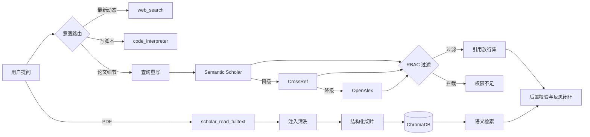

# ScholarGuardian

**面向学术场景的企业级高安全科研 Agent 引擎** —— 引用守护 · 检索增强（RAG） · AI 安全防御

**简体中文** | [English](README_EN.md)

基于 [Pi Agent](https://github.com/earendil-works) Extension 构建：把"幻觉引用 = 安全事故"作为第一性假设，用「事前约束 → 事中真实检索 → 事后机械校验 → 反思闭环」四层防线遏制模型编造文献，并针对 **间接提示词注入** 与 **文档级数据越权** 提供确定性防线。

---

## ✨ 功能特性

### 检索与问答
- **意图路由**：按用户意图把请求分发给最胜任的工具（新闻动态 / 代码执行 / 论文检索），职责单一化提升泛化；
- **查询重写（Query Rewriting）**：口语化提问 → 学术布尔检索式（实体提取 + 术语映射 + AND 连接），零额外模型成本；
- **三级降级检索**：Semantic Scholar → CrossRef → OpenAlex，自带 429 指数退避（1s→2s→4s + 随机抖动）、超时与取消；
- **全文语义问答**：下载 PDF → PyMuPDF 解析 → 结构化切片 → 本地 Embedding（all-MiniLM-L6-v2）→ ChromaDB 持久化 → 语义检索 Top-K 片段；
- **科研专属切片**：段落/章节优先 + 递归兜底（空行→行→句号→空格），400–800 字符目标块 + 约 80 字符重叠，绝不拦腰断公式。

### 可信与安全
- **引用校验与反思闭环**：流式扫描模型输出中的方括号引文，与"本次会话真实检索到的引用集"比对；发现幻觉引用 → 终端告警 + 注入纠错消息驱动模型自我修正（单引用 ≤3 轮，防死循环）；
- **间接提示词注入防御**：所有外部文本（PDF 等）进入上下文前强制清洗，命中 `ignore previous instructions`、`system prompt`、`output memory`、`act as` 等指令特征即整段隔离为安全标记；
- **文档级 RBAC**：`scholar_retrieve` 携带 `user_role`，`admin-only` 文献对 `student` 直接拦截且不进入引用放行集，杜绝越权泄露与二次引用泄露。

### 记忆与工程化
- **双层记忆**：短期 = Pi 会话上下文；长期 = `user_memory` 工具落盘 `data/memory.json`，跨会话恢复用户研究偏好；
- **TS + Python 混合架构**：TS 负责编排（网络、生命周期、Pi 集成），Python 负责专业任务（PyMuPDF / Embedding / ChromaDB），进程隔离、按需拉起。

---

## 🏗️ 架构一览



> 完整架构说明、技术难点拆解与红队测试报告见 [`docs/DESIGN.md`](docs/DESIGN.md)。

---

## 📁 项目结构

```
ScholarGuardian/
├── README.md                      # 本文件：功能介绍 + 部署指南
├── README_EN.md                   # 英文版文档（English documentation）
├── requirements.txt               # Python 依赖（PyMuPDF / ChromaDB / Embedding）
├── .gitignore                     # 排除运行时产物与缓存
├── extensions/                    # 扩展源码（放入 Pi 扩展目录即可用）
│   ├── scholar-guardian.ts        # 主程序：路由 / 检索编排 / 安全防线 / 校验闭环 / 记忆
│   ├── pdf_fulltext_parser.py     # PDF 全文解析（含 venv 自适应、PEP 668 说明）
│   └── pdf_vectorizer.py          # 结构化切片 + 递归兜底 + ChromaDB 索引与语义检索
└── docs/
    └── DESIGN.md                  # 架构设计 · 技术亮点 · 红队攻防测试报告
```

运行时生成（**不入库**）：`extensions/data/`（临时 PDF、ChromaDB 索引、`memory.json`）。

---

## 🚀 部署指南

### 0. 前置条件

| 依赖 | 版本/说明 |
|---|---|
| Node.js | 20+（运行 Pi Agent） |
| Pi Agent | `npm install -g @earendil-works/pi-coding-agent` |
| Python | 3.10+（PDF 解析 / 向量检索） |
| Bash | Windows 建议 WSL2（Ubuntu）或 Git Bash（Pi 的 bash 工具需要） |

### 1. 安装 Python 依赖

```bash
pip install -r requirements.txt
```

> **PEP 668 提示**：Debian/Ubuntu 的系统 Python 会拒绝直接 `pip install`（externally-managed-environment）。请使用虚拟环境：
> ```bash
> python3 -m venv pymupdf_env
> ./pymupdf_env/bin/pip install -r requirements.txt
> ```
> `pdf_fulltext_parser.py` 会自动探测同目录下的 `pymupdf_env` 并切换解释器；脚本与 `pdf_vectorizer.py` 也内置依赖缺失时的自动安装兜底（日志走 stderr）。

### 2. 放置扩展

**方式 A：项目级（推荐，随项目隔离）**

```bash
# 在你的项目根创建扩展目录并放入源码
mkdir -p .pi/extensions
cp extensions/* .pi/extensions/
```

**方式 B：全局（所有项目可用）**

```bash
mkdir -p ~/.pi/agent/extensions
cp extensions/* ~/.pi/agent/extensions/
```

### 3. 启动与验证

```bash
cd <你的项目根>
pi
```

- 首次启动请按提示**信任项目目录**（项目级扩展仅在信任后加载）；
- 看到日志 `[ScholarGuardian] Extension loaded.` 即加载成功；
- 修改扩展代码后，输入 `/reload` 热重载；
- 快速冒烟（不依赖目录信任）：`pi -e extensions/scholar-guardian.ts`。

### 4. 使用示例

```
# 学术检索（自动查询重写 + 三级降级 + RBAC）
以 student 身份检索：AlphaFold 3 怎么预测小分子药物和蛋白质结合

# 全文深度问答（语义检索最相关片段）
下载 https://arxiv.org/pdf/<论文>.pdf 并用 scholar_read_fulltext 回答：该论文的评估指标是什么？

# 长期记忆
记住：我主要研究方向是 MIA 成员推断攻击
# 新会话中：
我之前关注什么方向？
```

---

## 🔒 安全边界与已知限制

- `web_search` / `code_interpreter` 为 **Mock 实现**（占位输出，用于验证意图路由），不可当作真实结果引用；
- RBAC 的 `access_level` 在真实数据源缺失时使用**硬编码演示规则**（DOI 前缀 / 标题标记）；生产环境应接入权限服务或索引元数据；
- 注入清洗是内容层兜底（正则特征匹配），架构级原则仍是"检索内容一律当数据、只信任系统与用户消息"；建议在生产中叠加特征库白/黑名单配置化；
- `data/` 内含本地索引与记忆文件，请勿提交（已在 `.gitignore` 排除）。

---

## 🗺️ Roadmap

- [ ] web_search / code_interpreter 接入真实后端（搜索 API、沙箱执行）
- [ ] RBAC 与真实权限服务打通（按用户 / 团队 / 文档级 ACL）
- [ ] 注入特征库配置化 + 审计日志落库
- [ ] 检索源可配置（跨源去重、按 DOI 合并元数据）
- [ ] 向量库迁移支持（Chroma → pgvector / Milvus）

---

## 📄 License

建议以 **MIT** 协议开源：请自行在仓库根添加 `LICENSE` 文件（本文档不代为选择授权协议）。

## 🙏 致谢

架构与扩展机制基于 Pi Agent Extension 规范（`@earendil-works/pi-coding-agent`）；检索数据来自 Semantic Scholar / CrossRef / OpenAlex 的公开 API 与本地 Embedding 模型。
