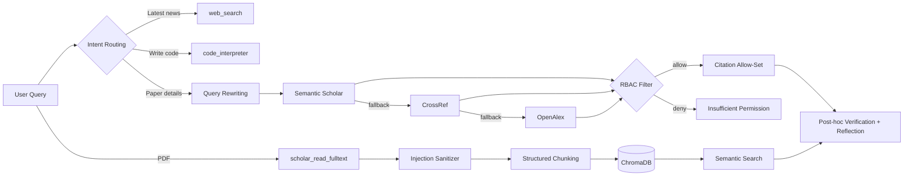

# ScholarGuardian

**An enterprise-grade, security-first research agent engine for academic workflows** — Citation Guard · Retrieval-Augmented Generation (RAG) · AI Safety Defenses

Built as a [Pi Agent](https://github.com/earendil-works) Extension. It treats *"a hallucinated citation is a security incident"* as a first principle, and blocks fabricated references through a four-layer defense: **prompt-time constraints → real retrieval → deterministic post-hoc verification → reflection loop**. It further provides deterministic defenses against **indirect prompt injection** and **document-level privilege escalation (RBAC)**.

[简体中文](README.md) | **English**

---

## ✨ Features

### Retrieval & Question Answering
- **Intent Routing** — dispatches requests to the most capable tool (news / code execution / paper retrieval), keeping each tool single-purpose for better generalization.
- **Query Rewriting** — turns colloquial questions into academic boolean queries (entity extraction + terminology mapping + `AND` composition) at zero extra model cost.
- **Three-Tier Fallback Retrieval** — Semantic Scholar → CrossRef → OpenAlex, with exponential backoff for HTTP 429 (1s → 2s → 4s + jitter), timeouts and cancellation support.
- **Full-Text Semantic QA** — download PDF → PyMuPDF parsing → structured chunking → local embeddings (all-MiniLM-L6-v2) → persistent ChromaDB → top-K semantic retrieval.
- **Research-Aware Chunking** — paragraph/section-first with recursive fallback (`\n\n` → `\n` → `。` → space); target chunks of 400–800 chars with ~80-char overlap, never cutting through formulas or words.

### Trust & Security
- **Citation Verification + Reflection Loop** — streams model output, extracts bracketed citations, and validates them against the set of references *actually retrieved in this session*. Hallucinated citations trigger a terminal alert plus an injected correction message that drives model self-correction (max 3 rounds per citation to avoid infinite loops).
- **Indirect Prompt Injection Guard** — all external text (PDFs, etc.) is sanitized before entering the context. Paragraphs matching instruction-like patterns (`ignore previous instructions`, `system prompt`, `output memory`, `act as`, …) are quarantined and replaced with a safety marker.
- **Document-Level RBAC** — `scholar_retrieve` carries a `user_role`; `admin-only` documents are blocked for `student` and are never added to the citation allow-list, preventing both direct and indirect (citation-based) leakage.

### Memory & Engineering
- **Dual-Layer Memory** — short-term: Pi session context; long-term: the `user_memory` tool persists research preferences to `data/memory.json` and restores them across sessions.
- **TypeScript + Python Hybrid** — TS orchestrates networking, lifecycle and Pi integration; Python handles domain-heavy work (PyMuPDF / embeddings / ChromaDB). Process isolation, on-demand startup, no resident services.

---

## 🏗️ Architecture



> Full architecture notes, engineering deep-dives and the red-teaming report: [`docs/DESIGN.md`](docs/DESIGN.md) (Chinese).

---

## 📁 Project Structure

```
ScholarGuardian/
├── README.md                      # Chinese documentation (features + deployment)
├── README_EN.md                   # This file
├── requirements.txt               # Python deps (PyMuPDF / ChromaDB / Embedding)
├── .gitignore                     # Excludes runtime artifacts and caches
├── extensions/                    # Source code — drop into your Pi extension dir
│   ├── scholar-guardian.ts        # Core: routing / retrieval / defenses / verification / memory
│   ├── pdf_fulltext_parser.py     # PDF full-text parsing (venv-aware, PEP 668 notes)
│   └── pdf_vectorizer.py          # Structured chunking + ChromaDB indexing & search
└── docs/
    └── DESIGN.md                  # Architecture · Technical highlights · Red-team report
```

Runtime artifacts (**not committed**): `extensions/data/` (temp PDFs, ChromaDB index, `memory.json`).

---

## 🚀 Deployment

### 0. Prerequisites

| Dependency | Notes |
|---|---|
| Node.js | 20+ (to run Pi Agent) |
| Pi Agent | `npm install -g @earendil-works/pi-coding-agent` |
| Python | 3.10+ (PDF parsing / vector search) |
| Bash | On Windows, use WSL2 (Ubuntu) or Git Bash — Pi's bash tool requires it |

### 1. Install Python dependencies

```bash
pip install -r requirements.txt
```

> **PEP 668 note**: Debian/Ubuntu system Python refuses direct `pip install` (`externally-managed-environment`). Use a virtual environment:
> ```bash
> python3 -m venv pymupdf_env
> ./pymupdf_env/bin/pip install -r requirements.txt
> ```
> `pdf_fulltext_parser.py` auto-detects a sibling `pymupdf_env` and switches interpreters; both Python scripts also include dependency auto-install fallbacks (logs go to stderr).

### 2. Install the extension

**Option A: project-local (recommended, isolated per project)**

```bash
mkdir -p .pi/extensions
cp extensions/* .pi/extensions/
```

**Option B: global (available to all projects)**

```bash
mkdir -p ~/.pi/agent/extensions
cp extensions/* ~/.pi/agent/extensions/
```

### 3. Run and verify

```bash
cd <your-project-root>
pi
```

- On first launch, **trust the project directory** when prompted (project-local extensions only load after trust);
- The log line `[ScholarGuardian] Extension loaded.` confirms successful loading;
- After editing the extension, type `/reload` to hot-reload;
- Quick smoke test without trust: `pi -e extensions/scholar-guardian.ts`.

### 4. Usage examples

```
# Academic retrieval (auto query rewriting + three-tier fallback + RBAC)
As a student, retrieve: how does AlphaFold 3 predict small-molecule drug binding to proteins?

# Full-text deep QA (semantic retrieval of the most relevant passages)
Download https://arxiv.org/pdf/<paper>.pdf and use scholar_read_fulltext to answer: what evaluation metrics does this paper use?

# Long-term memory
Remember: my main research direction is membership inference attacks (MIA)
# In a new session:
What research direction was I focused on?
```

---

## 🔒 Security Boundaries & Known Limitations

- `web_search` and `code_interpreter` are **mock implementations** (placeholder outputs for routing tests) and must not be cited as real results;
- RBAC uses **hard-coded demo rules** (DOI prefix / title marker) when real sources lack `access_level` metadata; production deployments should integrate a permission service or indexed ACLs;
- The injection guard is a content-layer fallback (regex heuristics). The architectural principle remains *"treat all retrieved content as data, trust only system/user messages as instructions"*; consider a configurable pattern store in production;
- `data/` contains local indexes and memory files — never commit it (already excluded in `.gitignore`).

---

## 🗺️ Roadmap

- [ ] Replace mock `web_search` / `code_interpreter` with real backends (search API, sandboxed execution)
- [ ] Integrate RBAC with a real permission service (per-user / team / document ACLs)
- [ ] Configurable injection pattern store + persistent audit logs
- [ ] Configurable retrieval sources (cross-source dedup, DOI-based metadata merge)
- [ ] Pluggable vector stores (Chroma → pgvector / Milvus)

---

## 📄 License

**MIT** is recommended. Please add a `LICENSE` file at the repository root yourself — this document does not choose a license on your behalf.

## 🙏 Acknowledgements

Architecture and extension mechanics follow the Pi Agent Extension specification (`@earendil-works/pi-coding-agent`). Retrieval data comes from the public Semantic Scholar / CrossRef / OpenAlex APIs, with local embeddings served by `sentence-transformers`.
